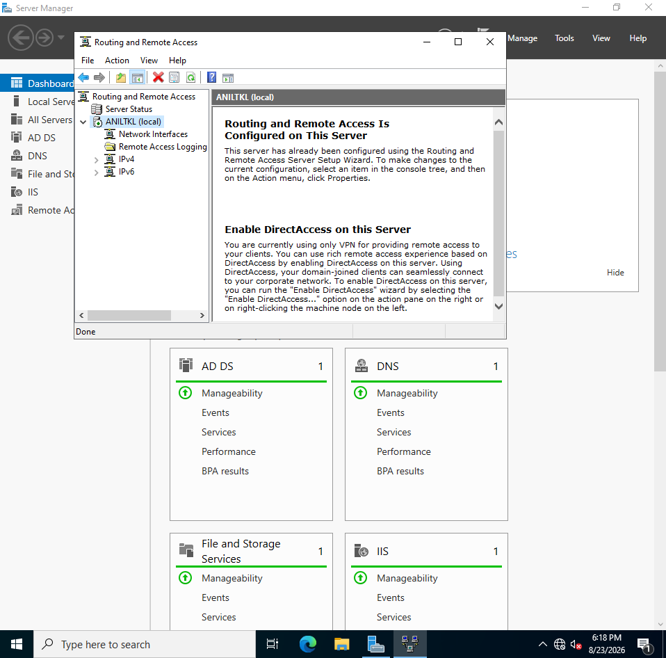
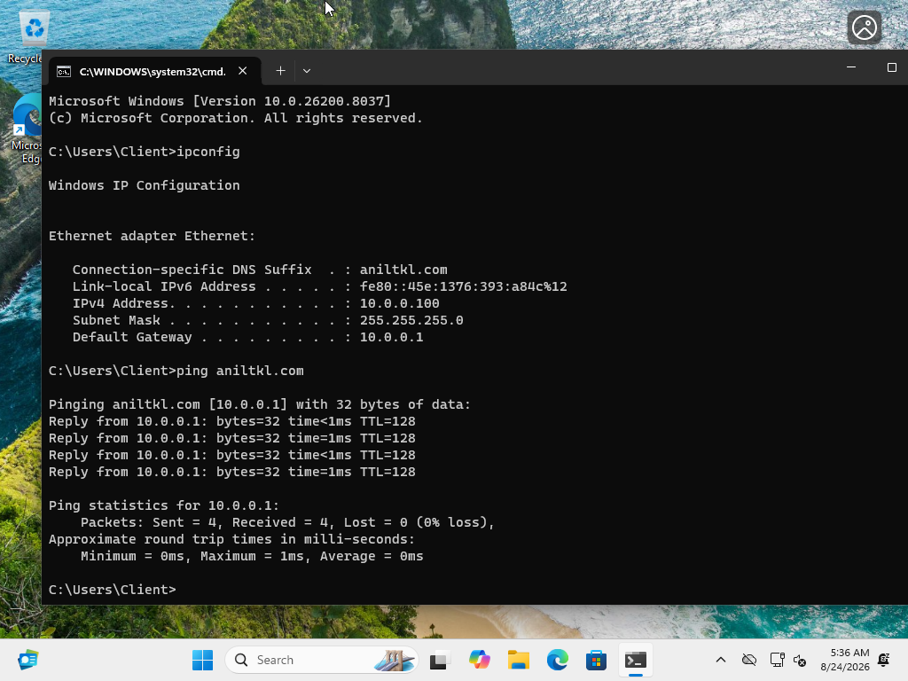

# Active Directory & Network Services Lab

A hands-on implementation of an Active Directory Domain Services (AD DS) environment hosted on Windows Server 2022 using Oracle VirtualBox. This lab demonstrates identity management, network infrastructure services (DHCP, NAT, DNS), and automated bulk user provisioning using PowerShell scripts.

---

## Technical Overview

- **Operating System:** Windows Server 2022 Standard Evaluation
- **Domain Name:** `aniltkl.com`
- **Domain Controller / Server Name:** `AnilTkl`
- **Network Scope:** `10.0.0.0/24` (DHCP Scope: `10.0.0.100` - `10.0.0.200`, Gateway: `10.0.0.1`)
- **Key Roles Installed:**
  - Active Directory Domain Services (AD DS)
  - DHCP Server
  - Routing and Remote Access (RAS / NAT)
  - Remote Server Administration Tools (RSAT)

---

## Project Execution & Architecture

### 1. Active Directory Domain Services Setup

Installed Active Directory Domain Services (AD DS) alongside Group Policy Management and RSAT tools to establish the domain controller for `aniltkl.com`.

<p align="center">
  
</p>

---

### 2. Organizational Units & Group Administration

Configured the Active Directory structure by creating essential Organizational Units (OUs), such as `admin` and `1USERS`, and designated domain administrative privileges to administrative user accounts.

<p align="center">
  
  
</p>

---

### 3. Remote Access & Network Address Translation (NAT)

Configured Remote Access tools and set up Network Address Translation (NAT) via Routing and Remote Access Service (RRAS). This allows clients on the internal `10.0.0.0/24` subnet to access the internet safely through the host network.

<p align="center">
  
  
</p>

<p align="center">
  
</p>

---

### 4. DHCP Server Configuration

Installed and configured the DHCP role to automatically assign IPv4 addresses to client virtual machines within the `10.0.0.100` to `10.0.0.200` range (`/24` subnet mask).

<p align="center">
  
  
</p>

<p align="center">
  
</p>

---

### 5. Automated Bulk User Provisioning via PowerShell

Developed a PowerShell script (`user_adding.ps1`) to read user list files (`usernames.txt`), extract names, format usernames, and automatically populate the Active Directory domain with multiple accounts inside the `1USERS` Organizational Unit.

```powershell
# PowerShell User Creation Script Summary
$userPass = "********"  # Secure password string
$names = Get-Content "C:\Users\aniltkl\Desktop\usernames.txt"
$password = ConvertTo-SecureString $userPass -AsPlainText -Force
$domain = (Get-ADDomain).DistinguishedName

foreach ($line in $names) {
    $first = $line.Trim().Split(" ")[0].ToLower()
    $last = $line.Trim().Split(" ")[1].ToLower()
    $user = "$($first[0])$last"

    Write-Host "Creating user: $user"

    New-ADUser -AccountPassword $password `
               -GivenName $first `
               -Surname $last `
               -DisplayName $user `
               -Name $user `
               -EmployeeID $user `
               -PasswordNeverExpires $true `
               -Path "OU=1USERS,$domain" `
               -Enabled $true
}
```

<p align="center">
  
</p>

<p align="center">
  
</p>

---

### 6. Client Verification & Domain Connectivity

Started a Windows 11 client machine, verified IP address lease acquisition via DHCP (`10.0.0.100`), tested default gateway routing (`10.0.0.1`), and confirmed active network connectivity to `aniltkl.com` via DNS ping tests.

<p align="center">
  
  
</p>
